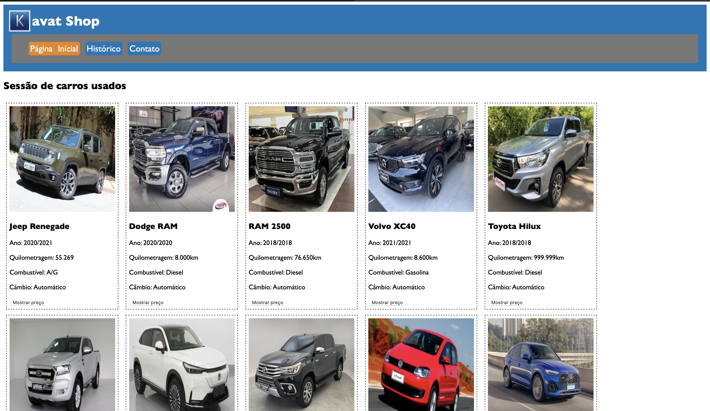

<h1 align="center"> Kavat Shop</h1>

<h4 align="center"><a href="https://alexandresantosal91.github.io/kavat-shop/">Clique para visitar o projeto</a></h4>

## 📚 Seções

O site é composto por três seções:

- **Home:** Página Inicial;
- **Histórico:** em-breve;
- **Contato:** em-breve;

## 💼 Tecnologias utilizadas

Para o desenvolvimento deste site utilizei as seguintes tecnologias:

- HTML;
- CSS;
- JavaScript;

<h2>Autor</h2>

<table>
  <tr>
    <td align="center">
<a href="https://github.com/alexandresantosal91">

 
        
          <b>Alexandre Santos</b>
        
      </a>
    </td>
  </tr>
</table>
